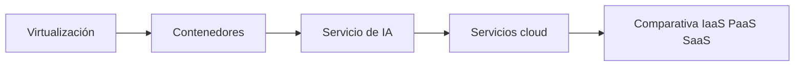

# ☁️ Cloud Lab

## Datos del alumno

| Campo | Información |
|---|---|
| Alumno/a | Nombre Apellido |
| Repositorio | `cloud-lab-omedesd` |
| URL de GitHub | `https://github.com/usuario/cloud-lab-omedesd` |
| Curso | 2.º ASIR |
| Grupo | Completar |
| Fecha de inicio | DD/MM/AAAA |

## Estado del proyecto

| Bloque | Estado |
|---|---|
| RA1 · Virtualización | 🟡 En progreso |
| RA2 · Cloud | ⚪ Pendiente |
| RA3 · Contenedores | ⚪ Pendiente |
| Proyecto final | ⚪ Pendiente |

## Última actualización

El alumno debe indicar aquí la última actualización relevante:

- **Fecha:** DD/MM/AAAA
- **Último cambio:** Describir brevemente
- **Último commit:** Copiar el identificador visible en GitHub

!!! info
    La fecha real y el historial completo se comprueban en GitHub mediante los commits.

## Arquitectura general

