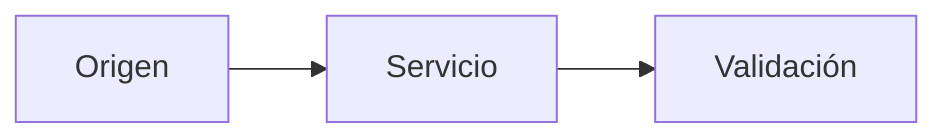

# H5 · Plataforma Docker

## Objetivo

Describe qué debes construir.

## Datos de conexión

| Dato | Valor |
|---|---|
| Equipo o servicio | Completar |
| IP o URL | Completar |
| Puerto | Completar |
| Usuario | Completar |
| Método de acceso | SSH, web u otro |
| Credenciales | No incluir contraseñas reales |

!!! warning
    No publiques contraseñas, claves privadas, tokens ni datos sensibles en GitHub.

## Arquitectura



## Procedimiento

Explica los pasos relevantes.

## Evidencias

### Capturas

Añade capturas con pie y explicación.

### Comandos

```bash
# Comandos relevantes
```

### Pruebas

| Prueba | Resultado esperado | Resultado obtenido |
|---|---|---|
| | | |

## Incidencias

### Problema

### Diagnóstico

### Solución

## Reflexión

¿Qué has aprendido y qué mejorarías?
